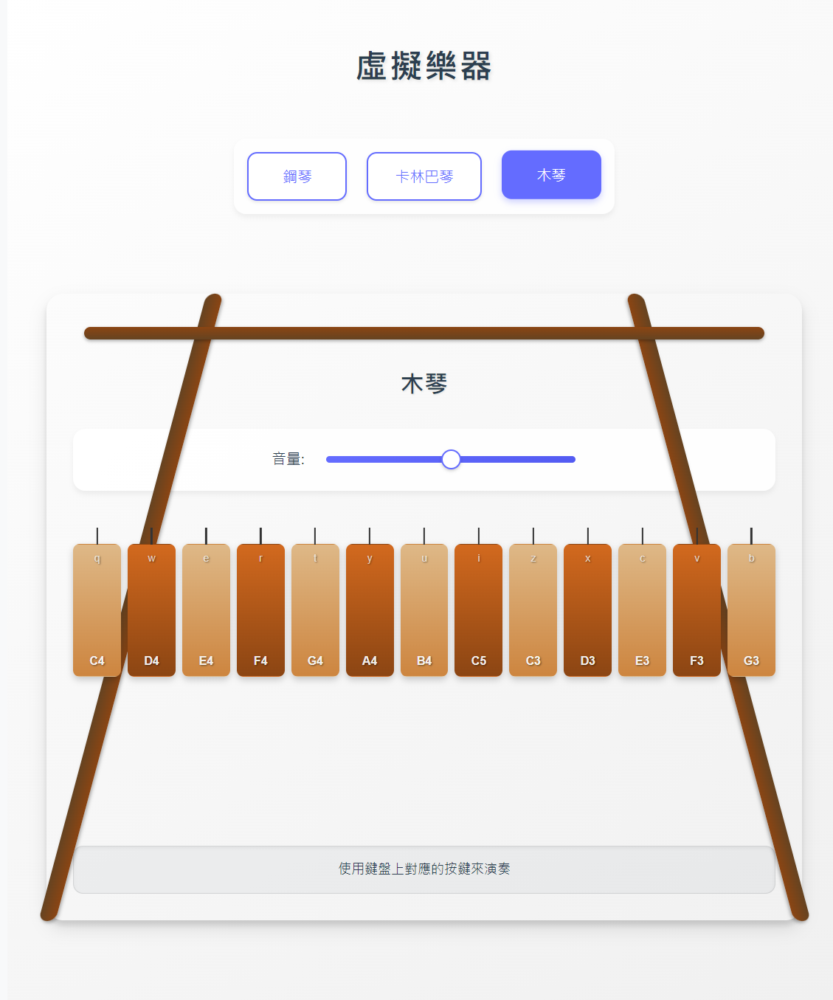

# 🎹 虛擬樂器 Virtual Instruments

一個使用 React + TypeScript 開發的虛擬樂器網頁應用，包含鋼琴、木琴和卡林巴琴。

## ✨ 功能特色

- 🎹 鋼琴：25 個琴鍵（C3-C5）
- 🎵 木琴：13 個音條（C3-C5）
- 🎼 卡林巴琴：11 個音條（G3-C5）
- 🔊 可調節音量
- ⌨️ 支持鍵盤按鍵演奏
- 🖱️ 支持滑鼠點擊演奏

## 🖼️ 應用截圖

### 鋼琴界面

### 木琴界面

### 卡林巴琴界面

## 🛠️ 使用技術

- React 18
- TypeScript
- Web Audio API
- CSS3

## 🎮 使用說明

1. 選擇想要演奏的樂器
2. 使用鍵盤上對應的按鍵或滑鼠點擊來演奏
3. 使用音量滑桿調節音量大小

### 鍵盤對應：

#### 鋼琴

- 白鍵（低音）：Z、X、C、V、B、N、M
- 黑鍵（低音）：S、D、G、H、J
- 白鍵（高音）：Q、W、E、R、T、Y、U、I
- 黑鍵（高音）：2、3、5、6、7

#### 木琴

- 高音部分：Q、W、E、R、T、Y、U、I
- 低音部分：Z、X、C、V、B

#### 卡林巴琴

- 高音部分：Q、W、E、R、T、Y、U、I
- 低音部分：V、B、N

## 📦 安裝與運行
